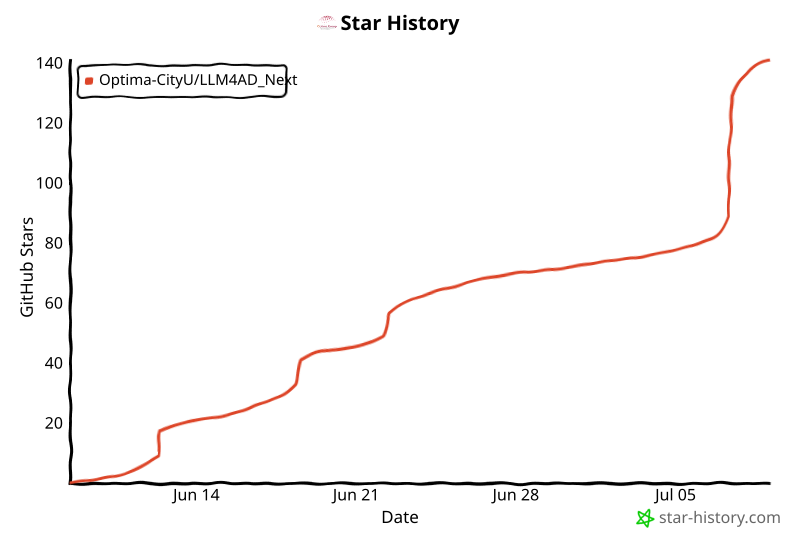

# LLM4AD_Next

<p align="center">
  <strong>From problem description to runnable evolutionary algorithm search — in one command.</strong><br>
  LLM-driven automated algorithm design with evolutionary optimization
</p>

<p align="center">
  <a href="https://pypi.org/project/llm4ad/">
    
  </a>
  <a href="https://pypi.org/project/llm4ad/">
    
  </a>
  <a href="https://github.com/Optima-CityU/LLM4AD_Next/blob/main/LICENSE">
    
  </a>
  <a href="https://github.com/Optima-CityU/LLM4AD_Next/actions/workflows/ci.yml">
    
  </a>
</p>

---

## 🔥 News

- 🚀 [2026.07][New Release]: **LLM4AD_Next Online Trial** is now available at [https://llm4ad-next.cn/](https://llm4ad-next.cn/) — try the full problem-to-algorithm workflow directly in your browser with no local setup.
- ✨ [2026.07][New Feature]: Introducing an **interactive problem-to-project workflow** that turns natural-language problem descriptions into runnable evolutionary algorithm search projects.
- 🐳 [2026.07][New Feature]: Versioned **Docker Hub deployment images** are now aligned with GitHub Release tags for reproducible local deployment.

## 🚀 Why LLM4AD_Next?

Traditionally, using Large Language Models for Automated Algorithm Design (LLM4AD) required a tedious, multi-step configuration pipeline. **LLM4AD_Next destroys this entry barrier.**

<div align="center">
  
</div>


With **LLM4AD_Next**, after creating your directory, all of these painful steps are fully automated through an interactive conversational terminal. Just run:

```bash
uv run llm4ad chat
```

Our built-in AI-powered consultant will interview you, instantly understand your requirements, and automatically generate a ready-to-run pipeline (evaluator, algorithm skeleton, configuration, and debugger) so you can leap straight into producing Useful Algorithms.

## 🎯 Key Features Overview

* 🧠 **LLM-Powered Design** & 🧬 **Evolutionary Optimization** combined to automatically evolve top-performing code.
* 💬 **Interactive Configuration (`llm4ad chat`)** — Your conversational AI consultant that generates the entire runnable app framework.
* 🔍 **Evolve-Block Advisor & Recommender** — Point LLM4AD_Next at any repository, and it will scan, score, and recommend exactly *which* blocks of code are most promising to evolve to hit your goals.

## Quick Start

<table>
  <tr>
    <td align="center" width="33%">
      <strong>Try Online</strong><br>
    </td>
    <td align="center" width="33%">
      <strong>Watch Instruction</strong><br>
    </td>
    <td align="center" width="33%">
      <strong>Read Docs</strong><br>
    </td>
  </tr>
  <tr>
    <td align="center" width="33%">
      Run LLM4AD_Next in your browser. No installation or API key required.
    </td>
    <td align="center" width="33%">
      Watch the introduction before installing or configuring a local environment.
    </td>
    <td align="center" width="33%">
      Use the documentation path map for setup, configuration, examples, and Web UI deployment.
    </td>
  </tr>
  <tr>
    <td align="center" width="33%">
      <a href="https://llm4ad-next.cn/">
        
      </a>
    </td>
    <td align="center" width="33%">
      <a href="https://youtu.be/x47kEosu0jk" target="_blank" rel="noopener noreferrer">
        
      </a>
    </td>
    <td align="center" width="33%">
      <a href="docs/en/index.md">
        
      </a>
    </td>
  </tr>
</table>

## Instruction Video

<div align="center">
  <a href="https://youtu.be/x47kEosu0jk" target="_blank" rel="noopener noreferrer">
    
  </a>
</div>


## Run LLM4AD

### Option A: Online Demo (No Installation Required)

Use the online demo from [Quick Start](#quick-start), or open it directly:
[Launch Online Demo](https://llm4ad-next.cn/).

No setup, no API key needed — just open the link and start designing algorithms.

### Option B: Local Installation

Requires **Python 3.12+** (pinned in `.python-version`) and [uv](https://github.com/astral-sh/uv) (recommended) or pip. A plain `uv sync` sets up everything, including the `chatv2` AI build agent, out of the box.

```bash
# Clone the repository
git clone https://github.com/Optima-CityU/LLM4AD_Next.git
cd LLM4AD_Next

# Install dependencies
uv sync

# Configure your LLM provider (see Global Settings section below)
# Or set environment variables directly:
export LLM_BASE_URL="https://api.openai.com/v1"
export LLM_API_KEY="your-api-key"
export LLM_MODEL="gpt-4o"

# Option 1: Interactive configuration (recommended for new users)
llm4ad chat

# Option 2: Run with an existing config file
llm4ad run examples/applications/tsp_benchmark_python/config.yaml
```

For optional dependency groups (`infra`, `providers`, `eval`, `dev`, `docs`, `all`) and uv installation, see the [Installation Guide](docs/en/guides/installation.md).

## Global Settings

Create `~/.llm4ad/settings.yaml` to configure shared providers across all projects:

```yaml
providers:
  - name: default
    type: openai
    api_key: ${OPENAI_API_KEY}
    model: gpt-4o
  - name: anthropic
    type: anthropic
    api_key: ${ANTHROPIC_API_KEY}
    model: claude-sonnet-4-20250514
```

Task configs then only need the provider name — credentials and model are resolved from global settings automatically.

For CLI commands, the interactive chat workflow, the Evolve-Block Advisor / Recommender, and the Python API, see the [Documentation](docs/en/index.md).

## Documentation

- [Documentation Home](docs/en/index.md)
- [Quick Start Guide](docs/en/guides/quickstart.md)
- [Configuration Guide](docs/en/guides/configuration.md)
- [Writing Evaluators](docs/en/guides/evaluators.md)

### Local Development

```bash
# Serve documentation with live reload
mkdocs serve

# Build static documentation
mkdocs build
```

## Project Structure

```
LLM4AD/
├── src/llm4ad/          # Main source code
│   ├── config/           # Configuration schemas and global settings
│   ├── consultant/       # Interactive configuration wizard
│   ├── builder/          # Task builder (analyzer, creator, validator, writer)
│   ├── advisor/          # Evolve-block advisor and recommender
│   ├── provider/         # LLM provider implementations
│   ├── planner/          # Algorithm planning layer
│   ├── coder/            # Code generation layer
│   ├── evaluator/        # Evaluation layer
│   ├── orchestrator/     # Workflow orchestration
│   ├── infra/            # Infrastructure (Ray, monitoring)
│   └── utils/            # Utilities
├── examples/             # Example configurations and applications
├── tests/                # Test suite
└── docs/                 # Documentation
```

## Contributing

Contributions are welcome! Please read our [Contributing Guide](docs/en/contributing/guidelines.md) for details.

```bash
# Set up development environment
uv sync --extra all

# Run tests
pytest

# Format code
black src/ tests/
ruff check src/ tests/ --fix
```

## License

This project is licensed under the BSD 3-Clause License - see the [LICENSE](LICENSE) file for details.

## Support

- [Documentation](docs/en/index.md)
- [Discussions](https://github.com/Optima-CityU/LLM4AD_Next/discussions)
- [Issue Tracker](https://github.com/Optima-CityU/LLM4AD_Next/issues)

## Join the Community

Scan the QR code with WeChat to join the LLM4AD_Next community group.

<div align="center">
  
</div>

## Star History

<!-- star-history:start -->
<picture>
  <source media="(prefers-color-scheme: dark)" srcset="docs/assets/star-history/star-history-dark-20260709034730.svg">
  
</picture>
<!-- star-history:end -->
