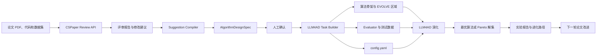

# CSPaper 与 LLM4AD_Next 算法进化 Pipeline

> 文档状态：第一版已实现
> 更新时间：2026-08-12
> 目标：利用 CSPaper 对论文给出的建议，生成算法设计方向、可评估目标和
> LLM4AD_Next 任务配置，并通过 evaluator 驱动算法持续迭代。

## 当前实现

第一版代码位于 `src/llm4ad/integrations/cspaper/`，已经提供：

- CSPaper Agentic Review API 的 PDF 提交和异步轮询；
- 原始 JSON 与 Markdown 评审结果保存；
- Markdown 评审到 `AlgorithmDesignSpec` 的保守编译；
- 人工确认和严格校验；
- 将规格注入现有 LLM4AD 任务的 Planner 背景；
- evaluator 指标、数据路径和 EVOLVE 区域的启动前审计；
- 调用现有 Task Builder 生成新任务；
- 调用现有 `LLM4AD.run()` 执行进化；
- Top-K 候选代码、排行榜和父子谱系导出。

完整可运行示例见 `examples/integrations/cspaper_algorithm_demo/`。

当前限制是：Markdown 自动分类采用保守规则，复杂或含糊的评审会进入
`pending_suggestions`；Builder 生成的 evaluator 仍必须通过预检和本地测试；
CSPaper 的 Code Check 尚未作为候选执行器使用。

## 1. 背景

CSPaper 擅长从论文评审视角发现问题，例如：

- 算法效果不足；
- 缺少效率或复杂度分析；
- 约束处理不完整；
- baseline 不充分；
- 实验数据覆盖不足；
- 方法描述与实验结论不一致。

这些建议通常是自然语言，不能直接作为 LLM4AD_Next 的优化目标。
LLM4AD_Next 需要的是可以执行和比较的任务定义：

- 哪段代码允许被修改；
- 算法输入和输出是什么；
- 什么结果属于非法结果；
- 哪些指标需要最大化或最小化；
- 使用哪些数据进行评估；
- 每次评估允许消耗多少时间和资源。

因此，**需要增加一层 `Suggestion Compiler`，将 CSPaper 的评审建议**
**编译为结构化的算法设计规格，再交给现有 Task Builder 和演化系统。**

## 2. 核心定位

三个组件的职责如下：

```text
CSPaper：
  发现论文、算法和实验中值得改进的方向。

Suggestion Compiler：
  将评审语言转换为搜索方向、目标、约束、数据需求和评估预算。

LLM4AD_Next：
  根据 evaluator 的反馈生成、筛选并迭代算法。
```

最重要的设计原则是：

> CSPaper 负责告诉系统“应该往哪里改”，evaluator 负责判断“改完以后是否
> 真的更好”。

CSPaper 不应直接作为每一代算法的 evaluator，原因包括：

- 网络评审成本高，无法支撑大量候选算法的反复评估；
- LLM 评审存在随机性，不适合作为唯一的数值适应度；
- 网络调用会降低实验可复现性；
- CSPaper 主要评估论文，而不是逐个执行算法候选；
- 本地 evaluator 更容易控制数据、超时、硬约束和隐藏测试集。

## 3. 目标与非目标

### 3.1 目标

- 接收论文 PDF 和 CSPaper 评审结果；
- 从评审中提取与算法设计有关的建议；
- 将建议分成搜索方向、目标、约束、数据需求和非算法建议；
- 生成人工可确认的 `AlgorithmDesignSpec`；
- 复用 LLM4AD_Next Task Builder 生成 evaluator、算法骨架和配置；
- 根据目标数量自动选择单目标或多目标演化方式；
- 输出最佳算法、Pareto 解集、指标变化和进化路径；
- 将成功经验与失败经验写入现有记忆模块。

### 3.2 第一阶段非目标

- 自动修改或重新撰写整篇论文；
- 使用 CSPaper 直接评价每一代候选算法；
- 完全取消人工确认；
- 自动证明任意论文中的理论结论；
- 依赖尚未稳定开放的 CSPaper Code Check API；
- 一开始就支持所有论文类型。

第一版优先支持具有明确输入、输出和数值指标的算法论文。

## 4. 端到端 Pipeline



## 5. 建议分类&转换规则

| CSPaper 建议类型 | 系统转换结果 | 示例 |
| --- | --- | --- |
| 可直接计算的改进目标 | evaluator metric | 路径长度、准确率、运行时间 |
| 必须始终满足的要求 | hard constraint | 容量不超限、输出不重复 |
| 算法或策略改进想法 | search direction | 自适应邻域、多起点搜索 |
| 实验覆盖问题 | dataset requirement | 增加大规模或分布外实例 |
| 资源或工程问题 | budget/monitor metric | 内存、超时、模型大小 |
| baseline 不充分 | baseline requirement | 与贪心算法和论文方法比较 |
| 写作、引用或表达问题 | excluded suggestion | 补充相关工作、重写摘要 |
| 无法可靠测量的建议 | pending confirmation | “提高创新性” |

转换时必须遵守以下规则：

1. 只有可以通过代码和数据计算的内容才能成为 evaluator metric。
2. 搜索方向只能影响 planner/coder prompt，不能直接当作分数。
3. 硬约束优先于软指标，非法解不能靠其他高分抵消。
4. CSPaper 建议必须保留来源文本，便于审计转换是否正确。
5. 无法验证的目标需要人工确认，不允许自动编造评价公式。

## 6. 中间数据协议

新增 `AlgorithmDesignSpec`，作为 CSPaper 和 LLM4AD_Next 之间的稳定协议。

```json
{
  "schema_version": "1.0",
  "paper": {
    "title": "Example Paper",
    "source_path": "./paper.pdf",
    "cspaper_job_id": "job-id",
    "review_agent_id": "ICML_main_2026_1"
  },
  "problem": {
    "name": "capacitated_vehicle_routing",
    "type": "combinatorial_optimization",
    "description": "Find feasible vehicle routes with minimum total distance.",
    "input_format": "CVRP instance JSON",
    "output_format": "List of vehicle routes"
  },
  "search_directions": [
    {
      "id": "direction-1",
      "description": "Use adaptive neighborhood selection",
      "priority": "high",
      "source_suggestion_id": "suggestion-3"
    }
  ],
  "objectives": [
    {
      "name": "total_distance",
      "direction": "minimize",
      "weight": 1.0,
      "formula": "sum of Euclidean route edge lengths",
      "aggregation": "mean",
      "source_suggestion_id": "suggestion-1"
    },
    {
      "name": "candidate_runtime_ms",
      "direction": "minimize",
      "weight": 0.2,
      "formula": "candidate subprocess wall-clock time",
      "aggregation": "p95",
      "source_suggestion_id": "suggestion-2"
    }
  ],
  "constraints": [
    {
      "name": "visit_once",
      "type": "hard",
      "check": "each customer occurs exactly once"
    },
    {
      "name": "vehicle_capacity",
      "type": "hard",
      "check": "route demand does not exceed capacity"
    }
  ],
  "datasets": {
    "train": "./data/train",
    "validation": "./data/validation",
    "test": "./data/test",
    "hidden_test": "./data/hidden_test"
  },
  "baselines": [
    {
      "name": "nearest_neighbor",
      "required": true
    }
  ],
  "evaluation_budget": {
    "timeout_seconds": 60,
    "max_memory_mb": 2048,
    "repetitions": 3
  },
  "excluded_suggestions": [
    {
      "text": "Expand the related work section",
      "reason": "not an algorithm optimization objective"
    }
  ],
  "confirmation": {
    "status": "pending",
    "confirmed_by": null,
    "confirmed_at": null
  }
}
```

## 7. 与当前版本的连接点

### 7.1 Task Analyzer

当前 `AnalysisResult` 已包含：

- `problem_type`；
- `function_name` 和函数签名；
- `metrics`；
- `input_format` 和 `output_format`；
- `complexity_tier`；
- 数据集摘要和可视化规格。

建议增加：

- `constraints`；
- `search_directions`；
- `baselines`；
- `evaluation_budget`；
- `evidence_refs`；
- `objective_mode`；
- `human_confirmed`。

### 7.2 Task Creator

现有 Task Creator 可以生成：

- evaluator；
- 带 `EVOLVE_START`/`EVOLVE_END` 的算法骨架；
- `config.yaml`；
- `debug_run.py`；
- evaluator 测试；
- sample data。

集成时优先复用该流程，避免建立第二套任务生成系统。

`search_directions` 应写入：

- `background`；
- coder 的优化目标提示；
- planner 的上下文；
- 可选的项目级记忆卡片。

### 7.3 Config Recommender

当前 Config Recommender 根据 `complexity_tier` 推荐代数、种群规模和超时，
但默认生成 `island_ga`。建议增加目标感知的 orchestrator 选择：

| 任务特征 | 推荐方式 |
| --- | --- |
| 一个主要数值目标 | `island_ga` 或 `eoh` |
| 两个及以上独立目标 | `meoh` |
| 多个明显不同的数据分布 | `dyca` |
| 需要较深的策略组合搜索 | `mcts_ahd` |
| 需要反思和改写高层启发式 | `reevo` |

第一版可以采用简单、稳定的规则：

```text
objective_count == 1 -> island_ga
objective_count >= 2 -> meoh
```

### 7.4 Evaluator

Evaluator 建议采用三层结构：

```text
第一层：运行检查
  程序是否启动、是否超时、输出是否能解析。

第二层：合法性检查
  输出是否满足所有硬约束。

第三层：质量评估
  计算效果、速度、资源和稳定性指标。
```

硬约束失败时返回：

```python
EvaluationResult(
    score=0.0,
    metrics={},
    success=False,
    error_message="vehicle capacity exceeded",
)
```

合法输出返回完整指标：

```python
metrics = {
    "total_distance": total_distance,
    "candidate_runtime_ms": runtime_ms,
}

return EvaluationResult(
    score=self.compute_score(metrics),
    metrics=metrics,
    success=True,
)
```

多目标任务使用 MEoH：

```yaml
evolution:
  type: "meoh"
  objective_metrics:
    - "total_distance"
    - "candidate_runtime_ms"
```

指标名称必须与 evaluator 的 `Metric` 定义和
`EvaluationResult.metrics` 完全一致。

## 8. 数据集设计

建议至少拆分四类数据：

| 数据集 | 用途 | 是否参与演化 |
| --- | --- | --- |
| `sample` | 调试 evaluator 和输入输出协议 | 否 |
| `train` | 候选算法主要演化 | 是 |
| `validation` | 早停和配置选择 | 可选 |
| `hidden_test` | 最终泛化验证 | 否 |

注意：

- hidden test 不应出现在 planner/coder prompt 中；
- 不应只用论文表格中的少量实例作为训练数据；
- 运行时间指标应进行多次重复，避免系统抖动影响选择；
- 多种规模或分布的实例应分别记录子指标；
- 对失败、超时和非法输出要采用统一规则。

## 9. 当前代码结构

```text
src/llm4ad/integrations/cspaper/
├── __init__.py
├── client.py
├── schemas.py
├── compiler.py
├── bridge.py
├── cli.py
└── pipeline.py

tests/unit/integrations/
├── test_cspaper_client.py
├── test_cspaper_compiler.py
├── test_cspaper_bridge.py
└── test_cspaper_pipeline.py
```

各模块职责：

- `client.py`：提交 PDF、轮询状态、重试、缓存原始响应；
- `schemas.py`：定义评审结果、建议和 `AlgorithmDesignSpec`；
- `compiler.py`：把评审文本转换为结构化规格；
- `bridge.py`：渲染 Planner 上下文、注入派生配置并执行任务预检；
- `pipeline.py`：连接 CSPaper、Task Builder、LLM4AD 和 Top-K 导出；
- `cli.py`：注册 `llm4ad cspaper` 命令组。

## 10. CLI 设计

### 10.1 MVP：导入已有评审

```bash
llm4ad cspaper compile \
  --paper ./paper.pdf \
  --review ./cspaper-review.md \
  --code-path ./algorithm \
  --train-data ./data/train \
  --output ./algorithm-design-spec.json
```

### 10.2 生成 LLM4AD_Next 任务

```bash
llm4ad cspaper build \
  --spec ./algorithm-design-spec.json \
  --output ./generated-tasks
```

### 10.3 一体化运行

```bash
llm4ad cspaper evolve \
  --spec ./algorithm-design-spec.json \
  --task-dir ./generated-task \
  --top-k 10
```

### 10.4 API 接入后的用法

```bash
llm4ad cspaper submit \
  --paper ./paper.pdf \
  --agent-id ICML_main_2026_1 \
  --output-dir ./cspaper-output
```

API Key 推荐从环境变量读取，也可以通过 CLI 参数临时传入：

```text
CSPAPER_API_KEY
CSPAPER_API_URL
```

任何日志、配置和运行产物都不得保存明文 API Key。

## 11. 运行闭环

一次完整迭代建议包含：

1. 导入 CSPaper 评审；
2. 编译 `AlgorithmDesignSpec`；
3. 人工确认目标、约束和数据；
4. 生成 LLM4AD_Next 任务包；
5. 运行 evaluator 单元测试；
6. 运行 baseline 并记录基准值；
7. 使用少量实例进行 3 至 5 代 smoke run；
8. 检查分数方向和约束处理是否正确；
9. 正式运行演化；
10. 在 hidden test 上复评最佳个体；
11. 导出最佳算法、Pareto 解和进化路径；
12. 将实验结论写回论文或进入下一轮 CSPaper 检查。

## 12. 实施状态与后续计划

阶段 0、阶段 1、基础 Task Builder 桥接、API 接入和 Top-K 导出已经实现。
下面保留各阶段的设计与验收标准，用于后续加强自动分类、evaluator 质量、
hidden test 和记忆闭环。

### 阶段 0：输入与协议确认（已实现）

工作内容：

- 收集一份真实 CSPaper 评审样例；
- 确认论文是否有代码和可执行数据；
- 定义 `AlgorithmDesignSpec` Pydantic 模型；
- 建立建议分类和可测性规则。

交付物：

- `schemas.py`；
- 一份完整示例 spec；
- schema 校验测试。

验收标准：

- 同一份 spec 可以稳定序列化和反序列化；
- 每个 objective 都有方向和计算说明；
- 每个 hard constraint 都有明确检查方式；
- 原始建议能够追溯。

### 阶段 1：Markdown 导入 MVP（已实现）

工作内容：

- 支持读取 CSPaper 生成的 Markdown；
- 提取建议、评分和论文元数据；
- 将建议编译为 spec；
- 提供人工确认步骤；
- 暂不依赖 CSPaper API。

交付物：

- `adapter.py`；
- `compiler.py`；
- `validator.py`；
- `llm4ad cspaper compile`。

验收标准：

- 能从真实评审中区分算法建议和写作建议；
- 不能测量的建议不会自动变成 metric；
- 用户可以修改并确认生成结果。

### 阶段 2：Task Builder 集成（已实现基础桥接）

工作内容：

- 扩展 `AnalysisResult`；
- 将 spec 转换为 Task Builder 输入；
- 生成 evaluator、算法骨架、配置和测试；
- 把搜索方向注入 planner/coder context；
- 为多目标任务生成 MEoH 配置。

交付物：

- spec-to-analysis 转换器；
- `llm4ad cspaper build`；
- 示例任务包。

验收标准：

- 生成项目能通过现有 Task Validator；
- EVOLVE 标记合法；
- evaluator 可以在 sample data 上运行；
- 多目标指标名称完全匹配。

### 阶段 3：Evaluator 质量保障（已实现预检，持续加强）

工作内容：

- 加入硬约束检查；
- 加入 baseline；
- 增加超时、异常、非法 JSON 和资源限制测试；
- 划分 train/validation/hidden test；
- 检查重复运行稳定性。

交付物：

- evaluator test suite；
- baseline report；
- evaluator audit report。

验收标准：

- 错误算法必须被拒绝；
- baseline 可以稳定复现；
- 指标方向经过人工检查；
- evaluator 不访问 CSPaper 或其他在线 LLM。

### 阶段 4：自动调用 CSPaper API（已实现）

工作内容：

- 实现 PDF 提交；
- 实现异步轮询；
- 缓存原始响应；
- 支持失败重试和幂等提交；
- API 不可用时支持本地评审降级。

交付物：

- `client.py`；
- `llm4ad cspaper submit`；
- API mock tests。

验收标准：

- 不重复提交同一论文和 agent 组合；
- API Key 不进入日志和运行目录；
- 网络失败不会破坏已有 spec 和任务；
- 能从完成任务生成本地 Markdown 和原始 JSON。

### 阶段 5：演化结果与经验闭环（Top-K 与谱系已实现）

工作内容：

- 导出 `best/` 和 `best/pareto/`；
- 读取 `state/evolution_state.json`；
- 生成指标变化和进化路径摘要；
- 将高质量算法、失败反思和领域知识写入记忆模块；
- 使用 hidden test 生成最终实验表。

交付物：

- evolution report；
- hidden test report；
- memory cards；
- 论文可用实验结果。

验收标准：

- 可以追溯每个最佳算法的父代和改进思路；
- 多目标任务能够查看 Pareto 解；
- hidden test 与演化数据隔离；
- 经验记忆不会包含 API Key 或未授权论文全文。

## 13. 测试策略

### 单元测试

- CSPaper 响应解析；
- Markdown frontmatter 和正文解析；
- 建议分类；
- spec schema 校验；
- 目标方向映射；
- orchestrator 选择；
- evaluator 约束检查。

### 集成测试

- 本地评审 Markdown到任务包；
- spec 到 evaluator/config；
- sample data 到 evaluator 结果；
- 双目标 spec 到 MEoH；
- 网络错误和超时降级；
- hidden test 隔离。

### 端到端测试

建议选择一个已有 TSP 或 CVRP 示例：

```text
CSPaper 建议：
  需要考虑解质量和运行效率的权衡。

编译结果：
  minimize tour_length
  minimize candidate_runtime_ms

运行方式：
  MEoH

预期结果：
  best/pareto/<idx> 中导出多个质量/速度折中解。
```

## 14. 主要风险与控制措施

| 风险 | 后果 | 控制措施 |
| --- | --- | --- |
| CSPaper 建议不能直接测量 | evaluator 目标失真 | 可测性校验和人工确认 |
| evaluator 奖励漏洞 | 算法钻评分规则空子 | 隐藏测试、约束测试、结果审计 |
| 多指标尺度差异过大 | 加权分数失衡 | MEoH Pareto 选择或归一化 |
| 只优化论文已有数据 | 过拟合 | train/hidden test 隔离 |
| API 不稳定或任务时间长 | pipeline 阻塞 | 缓存、异步轮询、本地导入降级 |
| 论文建议包含提示注入文本 | 生成过程被操纵 | 内容隔离、结构化抽取、白名单字段 |
| 私有论文或代码泄露 | 数据安全问题 | 明确上传确认和本地优先模式 |
| 评审建议与作者意图冲突 | 优化错误方向 | 人工确认门禁 |

## 15. 已实现范围与剩余工作

当前第一版已经实现：

```text
CSPaper Markdown
    -> AlgorithmDesignSpec
    -> 人工确认
    -> Task Builder
    -> evaluator/config
    -> LLM4AD 演化
    -> Top-K 算法和谱系数据
```

同时支持从 CSPaper API 上传 PDF、异步轮询和幂等复用同一 PDF/agent
组合的提交记录。仍需继续完善：

- 更复杂评审文本的 LLM 辅助结构化解析；
- baseline 的自动执行和门槛比较；
- validation/hidden test 的独立复评报告；
- 成功与失败经验的长期记忆持久化；
- 进化结果自动回写论文实验章节。

这一范围可以优先验证真正的产品价值：

> CSPaper 提出的算法建议，能否被可靠转换成 evaluator，并通过
> LLM4AD_Next 找到更好的算法。

## 16. 建议拆分的开发 Issue

1. Define `AlgorithmDesignSpec` schema.
2. Add CSPaper Markdown result adapter.
3. Implement review suggestion compiler.
4. Add measurability and safety validation.
5. Extend `AnalysisResult` with constraints and search directions.
6. Add objective-aware orchestrator recommendation.
7. Generate MEoH config for multi-objective specs.
8. Add `llm4ad cspaper compile` command.
9. Add `llm4ad cspaper build` command.
10. Add CSPaper Platform API client.
11. Generate evolution and hidden-test reports.
12. Store validated evolution experience in memory.

## 17. 成功指标

第一版建议使用以下指标判断集成是否成功：

- CSPaper 算法建议识别准确率；
- 可测建议到 evaluator metric 的人工接受率；
- 自动生成任务一次通过验证的比例；
- evaluator 测试覆盖率；
- baseline 可复现率；
- 演化后 hidden test 相对 baseline 的提升；
- 错误或非法算法被 evaluator 拒绝的比例；
- 用户从评审到首次可运行演化所需时间。

最终目标不是“自动生成更多配置”，而是建立一条可信的证据链：

```text
CSPaper 建议
  -> 可审计的设计目标
  -> 可执行的 evaluator
  -> 可复现的算法演化
  -> 独立测试集上的真实改进
```

## 18. 参考资料

- CSPaper Partner Platform：
  <https://cspaper.org/platform>
- CSPaper Agentic Review API：
  <https://cspaper.org/platform/review>
- CSPaper Platform API Examples：
  <https://github.com/cspaper/platform-examples>
- LLM4AD_Next Task Builder：
  `src/llm4ad/builder/`
- LLM4AD_Next Evaluator：
  `src/llm4ad/evaluator/`
- LLM4AD_Next MEoH 指南：
  `docs/zh/guides/meoh.md`
- LLM4AD_Next 记忆配置：
  `src/llm4ad/config/memory.py`
