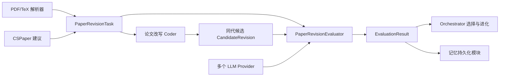

# 论文改写 Evaluator：两种优化思路与实现架构

`PaperRevisionEvaluator` 用于评价用户指定论文片段的多个改写版本。它将原文、CSPaper 建议、上下文和保护约束组合成评价任务，再通过多个 LLM 对候选改写进行评分、评议和选举，最终向 LLM4AD 返回可供进化算法选择的统一分数。

本文介绍当前实现的两种优化思路：

1. **Panel 模式**：多个 LLM 独立评分，用稳定的群体评价指导逐步优化。
2. **Debate 模式**：多个 LLM 在独立评审后进行交叉评议和投票，从多个候选中选出胜者。

## 职责边界

Evaluator 是进化流程中的“评价与选择依据”，不是论文编辑器。当前实现负责：

- 读取规范化的论文改写任务和候选文本；
- 在调用 LLM 前执行确定性的静态保护检查；
- 组织多 LLM 匿名评审；
- 汇总修改前分数、修改后分数和改进幅度；
- 在同代候选中标记胜者；
- 输出改进点、风险点和记忆候选。

当前实现不负责：

- 解析 PDF 或 TeX 文档；
- 调用 CSPaper 并定位待优化片段；
- 生成候选改写；
- 将胜出文本直接替换回原文；
- 将 `memory_candidates` 持久化为长期记忆。

这些能力应分别由上游解析器、CSPaper 适配器、论文改写 Coder 和下游编排器完成。



## 思路一：多评委独立评分

Panel 模式适合持续、稳定地优化一个指定片段。它让多个 LLM 分别比较原文与候选改写，再使用稳健统计汇总意见，降低单个模型的偏好和偶然误判。

### 处理流程

1. 从任务 JSON 读取原文、相邻上下文、CSPaper 建议、评分维度和保护约束。
2. 从每个候选 worktree 读取 `candidate.json` 或纯文本候选。
3. 执行引用、数字、锁定术语、LaTeX 结构和长度检查。
4. 根据 `random_seed + task_id` 从配置的模型中确定性地选择评委。
5. 对每个“候选 × 评委”构造一次匿名 A/B 比较。
6. 评委分别给原文和改写后的文本按 rubric 打分，并输出改进点、退步点、关键问题和置信度。
7. 将匿名 A/B 结果还原为 `before_score` 和 `after_score`。
8. 使用中位数聚合各维度分数，并计算最终候选分数。
9. 在同代有效候选中，将总分最高者标记为 `selected_winner`。

### 为什么使用匿名 A/B

原文和候选会被随机映射为 `TEXT A` 与 `TEXT B`。同一个任务、候选和评委的映射可以通过随机种子复现，但评委不知道哪一份是改写版本。这能减少“新版本一定更好”的位置偏见。

### Panel 评分

每个 rubric 维度先取所有有效评委分数的中位数，然后按照任务中定义的权重得到：

- `baseline_score`：原文加权分数；
- `revised_score`：候选改写加权分数；
- `score_delta`：`revised_score - baseline_score`；
- `judge_agreement`：根据评委对改写总分的离散程度计算的一致度。

最终分数为：

```text
score = clamp(
    revised_score
    + delta_weight * clamp(score_delta, -10, 10)
    - disagreement_weight * disagreement
    - static_check.penalty,
    0,
    100
)
```

这个公式同时考虑改写质量、相对提升、评委分歧和静态警告。聚合使用中位数，可以降低某个评委极端分数对结果的影响。

### 记忆候选

评委给出的 `key_improvements` 会转换为 `successful_pattern`，退步和关键问题会转换为 `risk`。只有满足以下条件的胜出候选才具有推荐写入记忆的资格：

- 改进幅度达到 `memory_min_delta`；
- 评委分歧不超过 `memory_max_disagreement`；
- 静态检查通过。

Evaluator 只输出 `memory_candidates`，不会直接修改长期记忆。

## 思路二：多模型辩论选举

Debate 模式适合在同一轮生成多个质量接近、修改方向不同的候选时进行选择。它不是让模型继续修改文本，而是让评委看到匿名候选和匿名初评，对初评中的薄弱论点进行反驳，并提交最终选票。

### 处理流程

1. 对每个候选先执行与 Panel 模式相同的静态检查和独立匿名评审。
2. 为有效候选分配 `C1`、`C2` 等匿名标签。
3. 将所有候选文本和初评摘要放入统一的 debate prompt。
4. 每个评委输出一份 `DebateBallot`，其中包含候选分数、完整排名、反驳意见、理由和置信度。
5. 检查每张选票是否完整包含所有候选。
6. 综合 rubric 质量、两两胜率和 Borda 排名积分，得到每个候选的最终分数。
7. 将最终分数最高的候选标记为胜者，并取消落选候选的记忆推荐资格。

如果有效候选不足两个，Debate 模式会自动退化为 `panel_fallback`，因为单个候选之间无法进行选举。

### Debate 评分

```text
final_score = (
    debate_rubric_weight * revised_score
    + debate_pairwise_weight * pairwise_win_rate * 100
    + debate_borda_weight * borda_percentile * 100
) / total_weight
```

三个组成部分分别表示：

| 组成部分 | 含义 |
|---|---|
| `revised_score` | 独立评审阶段得到的学术质量分数 |
| `pairwise_win_rate` | 选票排名中战胜其他候选的比例 |
| `borda_percentile` | 综合所有完整排名后的 Borda 百分位 |

默认权重为 `0.60 / 0.25 / 0.15`。因此独立 rubric 质量仍是主导因素，投票用于补充候选之间的相对比较。

## 两种模式的区别

| 对比项 | Panel 模式 | Debate 模式 |
|---|---|---|
| 主要目标 | 稳定评价每个候选是否优于原文 | 从多个候选中选出综合胜者 |
| 评价阶段 | 一轮独立匿名评审 | 独立评审 + 交叉评议和最终投票 |
| 候选要求 | 一个或多个均可 | 至少两个，否则退化为 Panel |
| 主要评分依据 | rubric 分数、提升幅度、分歧 | rubric、两两胜率、Borda 排名 |
| LLM 调用成本 | 较低 | 较高 |
| 适用场景 | 高频迭代、候选初筛 | 方向竞争、最终候选选择 |

推荐的组合方式是先用 Panel 模式进行多轮低成本进化，再对最后一轮的优质候选使用 Debate 模式选举。

## 最小配置示例

```yaml
evaluator:
  type: custom
  provider: judge_openai
  module: llm4ad.evaluator.paper_revision:PaperRevisionEvaluator
  mode: panel                  # 改为 debate 启用辩论选举
  judges:
    - judge_openai
    - judge_claude
    - judge_deepseek
  panel_size: 3
  min_judges: 2
  candidate_file: candidate.json
  random_seed: 42
  dataset:
    mode: files
    files:
      - paper-task.json
```

`judges` 中的名称必须对应顶层 `providers` 配置。`panel_size` 决定本次任务选择多少个评委，`min_judges` 是独立评审和最终投票都必须达到的法定人数。

## 实现结构

代码位于 `src/llm4ad/evaluator/paper_revision/`：

| 文件 | 作用 |
|---|---|
| `schemas.py` | 定义任务、候选、评委响应、选票、静态检查和聚合结果的数据契约 |
| `validation.py` | 在调用 LLM 前执行确定性保护检查 |
| `prompts.py` | 构造 Panel 匿名 A/B prompt 和 Debate 交叉评议 prompt |
| `aggregation.py` | 规范化评委报告，计算 Panel 与 Debate 分数，生成记忆候选 |
| `evaluator.py` | 组织完整批量评价流程、并发调用模型、处理法定人数并生成结果 |
| `__init__.py` | 导出对外使用的 evaluator 和主要数据类型 |

### 关键类

#### `BaseBatchEvaluator`

位于 `src/llm4ad/evaluator/base.py`。普通 evaluator 一次只接收一个候选，而 Debate 必须同时观察同一代的多个候选。`BaseBatchEvaluator` 定义：

```python
async def evaluate_batch(
    self,
    cfgs: list[EvalContext],
) -> list[EvaluationResult]:
    ...
```

返回结果必须与输入候选保持相同顺序，便于编排器将分数写回对应个体。

#### `PaperRevisionEvaluator`

这是核心编排类，继承 `BaseBatchEvaluator`。主要方法职责如下：

| 方法 | 职责 |
|---|---|
| `evaluate_batch()` | 批量评价入口，根据 `mode` 分发到 Panel 或 Debate |
| `_prepare_candidates()` | 加载共享任务和各 worktree 中的候选，执行静态检查 |
| `_select_judges()` | 确定性随机选择评委并检查 provider 与法定人数 |
| `_collect_reports()` | 并发执行所有候选的匿名独立评审 |
| `_evaluate_panel()` | 聚合独立报告并选择 Panel 胜者 |
| `_evaluate_debate()` | 组织交叉评议、最终选票和 Debate 胜者选择 |
| `_panel_result()` | 将内部聚合结果转换为标准 `EvaluationResult` |
| `_mark_winner()` | 确保同代只有最高分候选保留胜者标记 |

#### `PaperRevisionTask`

表示一次被评价的论文局部改写任务，主要包含：

- `original_text`：被用户选中的原文；
- `context_before/context_after`：相邻上下文；
- `cspaper_findings`：规范化后的 CSPaper 问题和建议；
- `constraints`：引用、数字、术语和 LaTeX 结构保护规则；
- `rubric`：所有评委共享的评分维度及权重。

默认 rubric 包括技术忠实度、CSPaper 问题解决程度、清晰与连贯性、证据完整性、简洁与学术风格。

#### `CandidateRevision`

表示一个候选改写，核心字段是 `candidate_id`、`section_id` 和 `revised_text`。`generation` 与 `parent_id` 用于记录其进化代数和父候选来源。

#### `PairwiseJudgeResponse` 与 `JudgeReport`

`PairwiseJudgeResponse` 是 LLM 对匿名 A/B 文本返回的结构化结果。`normalize_report()` 会将 A/B 映射还原为原文与改写，形成内部统一使用的 `JudgeReport`。

#### `DebateBallot`

表示一次最终投票，要求 `candidate_scores` 和 `ranking` 完整覆盖所有匿名候选。缺失或重复候选的选票会被判定为无效。

#### `StaticCheckResult` 与 `MemoryCandidate`

`StaticCheckResult` 保存静态检查是否通过、错误、警告、惩罚和检查明细。`MemoryCandidate` 保存可能进入长期经验库的成功模式或风险，但本身不产生持久化副作用。

#### `EvaluationDispatcher`

位于 `src/llm4ad/evaluator/dispatcher.py`。它识别 `BaseBatchEvaluator` 子类，将同一数据任务下的整批候选一次性交给 `evaluate_batch()`，而不是逐个调用。这是 Debate 模式能够比较同代候选的框架基础。

## 静态保护检查

`validate_revision()` 在消耗 LLM 调用之前检查：

- 候选 `section_id` 是否匹配任务；
- 修改后长度是否落在允许比例内；
- 原有 LaTeX 引用是否被删除；
- 是否加入未经允许的新引用；
- 数字与百分比是否改变；
- 锁定术语和锁定声明是否保留；
- LaTeX 花括号和环境是否配对。

硬性检查失败的候选不会进入 LLM 评审，返回 `static_valid = 0` 和 `score = 0`。文本与原文完全一致属于警告，会产生轻微惩罚，但不会直接拒绝。

## 输入与输出

每个批次共享一个 `PaperRevisionTask` 数据文件，每个候选 worktree 保存一个 `candidate.json`。Evaluator 最终返回标准 `EvaluationResult`。

稳定指标包括：

| 指标 | 含义 |
|---|---|
| `baseline_score` | 原文综合质量 |
| `revised_score` | 修改后综合质量 |
| `score_delta` | 相对原文的提升幅度 |
| `judge_agreement` | 多评委评分一致度 |
| `static_valid` | 是否通过静态保护检查 |

详细信息保存在 `EvaluationResult.metadata`，包括逐评委报告、静态检查结果、评委分歧、辩论选票、胜者标记和记忆候选。

## 关键设计原则

1. **客观保护先于主观评价**：先检查引用、数字和结构，再调用 LLM。
2. **原文与改写同时评分**：优化目标是相对提升，不只看孤立的改写分数。
3. **匿名与可复现并存**：通过确定性随机化降低位置偏见，同时支持复现实验。
4. **结构化输出**：所有评委响应使用 Pydantic schema 校验，避免自由文本难以聚合。
5. **群体意见优于单点评分**：使用多个 provider、中位数和分歧惩罚降低模型偶然性。
6. **评价与副作用分离**：Evaluator 输出胜者和记忆候选，但不直接修改论文或记忆库。

## 当前限制与后续扩展

当前任务和候选都只表示单个 `section_id`，尚不支持多个论文片段作为一个原子修改合并评价。Debate 也使用同一组模型完成初评和最终投票，尚未区分普通评委、rebuttal 评议员和主席模型。

后续可依次扩展：

1. 增加 `PaperRevisionCoder`，根据 CSPaper 建议和历史评价生成候选。
2. 将任务升级为多 `targets`、候选升级为多 `patches`，支持全文一致性评价。
3. 分离 `panel_judges`、`rebuttal_judges` 和 `chair_judge`。
4. 在用户确认胜者后，将推荐经验写入长期记忆。
5. 使用源文件哈希和 LaTeX 锚点安全地替换胜出片段。
